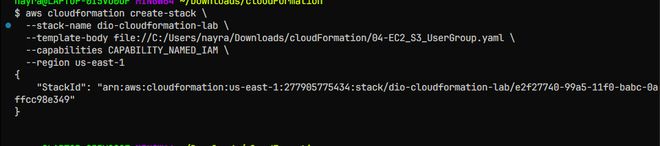
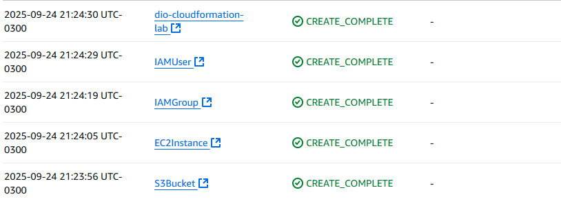
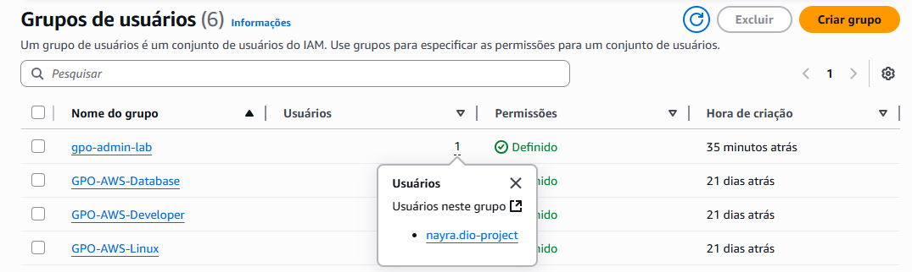
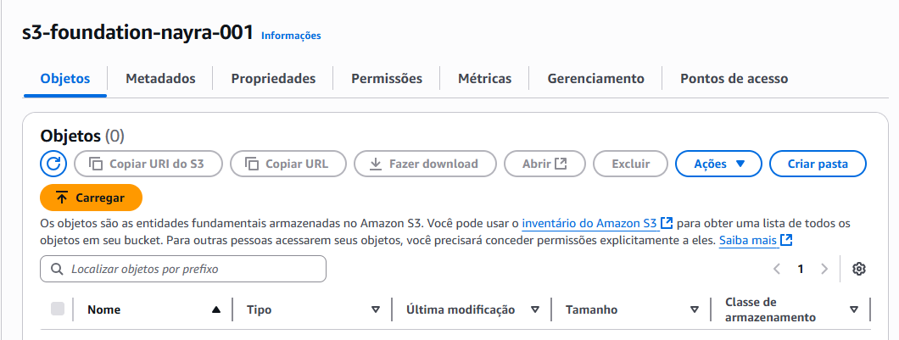
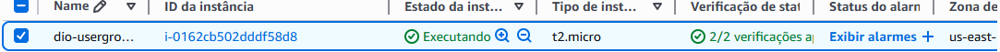

# Projeto CloudFromation - DIO Lab

## Descrição
Este projeto tem como objetivo crir uma **Stack na AWS** utilizando CloudFormation, automatizando a criação de:
- Um bucket s3
- Um grupo IAM e um usuário IAM
- Uma instância EC2 com security Group configurando

O projeto demonstra o uso de **infraestrutura como Código (IaC)**, aplicando práticas na AWS e documentando todo o processo.

## Arquivos do Repositório
- `04-EC2_S3_UserGroup.yaml`: Template CloudFormation utilizado para criar a stack.
- `/images`: Capturas de tela do processo de execução e recursos criados.

## ⚙️ Instruções para Executar
1. Verifique se possui o **AWS CLI configurado** na região `us-east-1`.
2. Certifique-se de ter um **Key Pair** existente para a instância EC2.
3. Rodar o comando para criar a stack:
```bash
aws cloudformation create-stack \
  --stack-name dio-cloudformation-lab \
  --template-body file://04-EC2_S3_UserGroup.yaml \
  --capabilities CAPABILITY_NAMED_IAM \
  --region us-east-1
```
## 🖼️ Evidências

### 1. Execução via CLI
Demonstração do comando utilizado para criar a stack:  


### 2. Stack criada com sucesso
Status `CREATE_COMPLETE` no CloudFormation:  


### 3. IAM – Grupo e Usuário criados


### 4. Bucket S3 provisionado


### 5. Instância EC2 rodando



---

## 📌 Tecnologias utilizadas
- **AWS CloudFormation**
- **AWS CLI**
- **Amazon EC2**
- **Amazon S3**
- **AWS IAM**

---

## ✍️ Autor
Projeto criado para estudos de CloudFormation.
Atividade Criada por:

Professor:
**[Alexsandro Lechner]** 

Aluno(a):
**[Nayra Rodrigues]**
